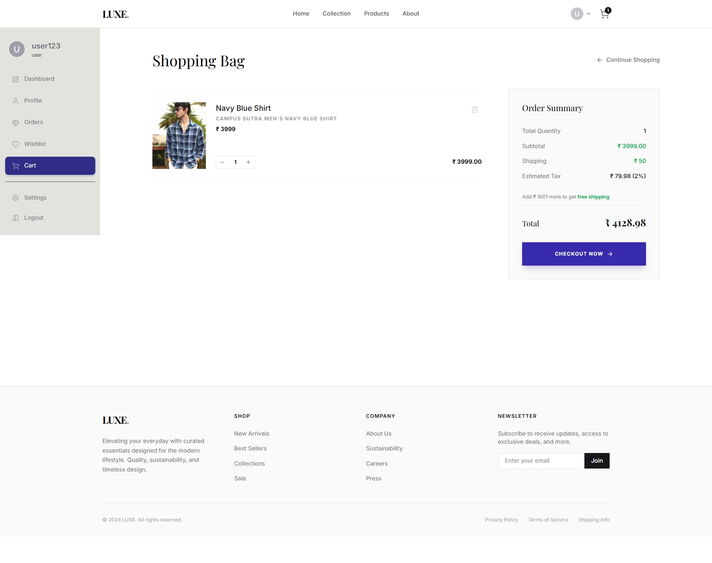
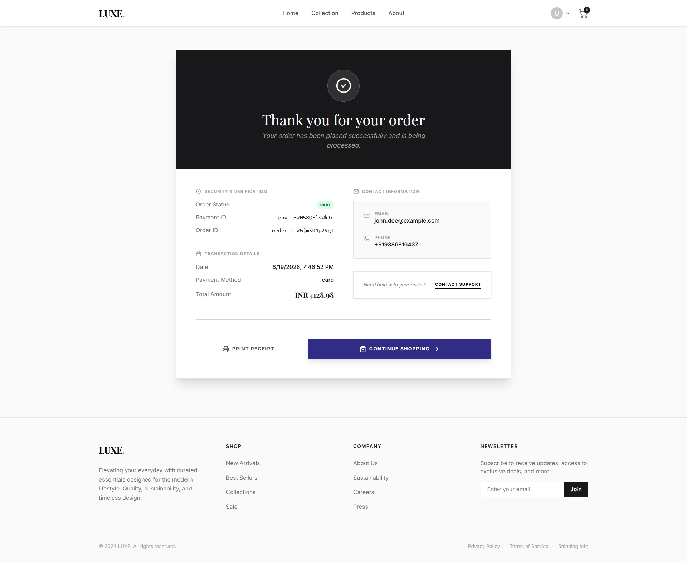
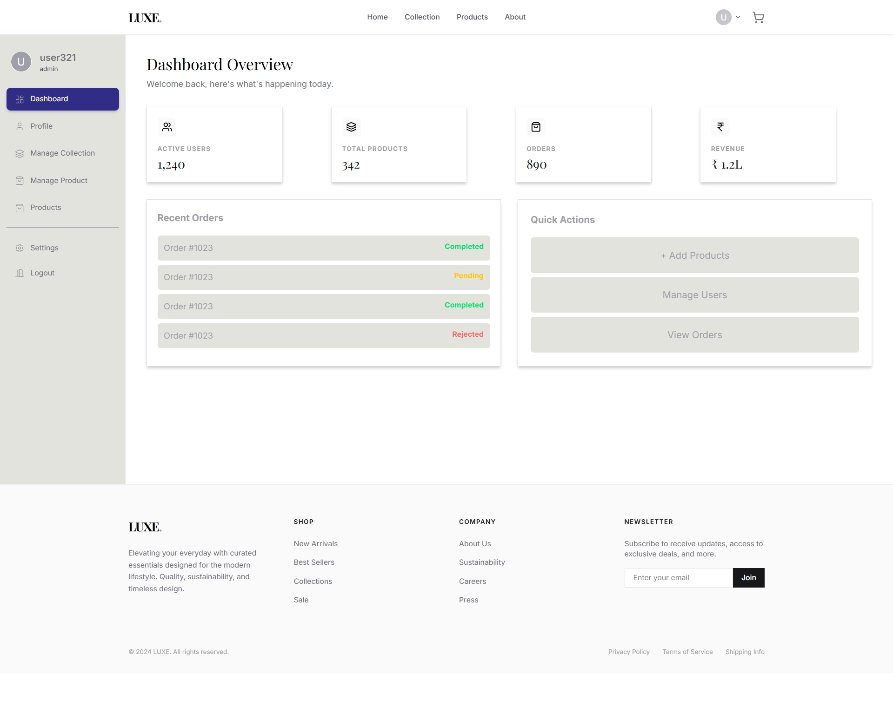

# 🛍️ EcomApp - Full Stack E-Commerce Platform

EcomApp is a modern full-stack e-commerce application built using the MERN stack. The platform allows users to browse products, manage their cart and wishlist, complete purchases through Razorpay, and access personalized dashboards. It also includes an admin panel for managing products and collections.

> 🚧 **Work In Progress**
>
> This project is currently under active development. New features, UI improvements, and backend enhancements are continuously being added.

---

# 🚀 Live Demo

🔗 **Live Website:** [live@Vercel](https://ecom-app-teal.vercel.app/)

---

# 📸 Project Screenshots

## 🏠 Home Page


---

## 🛍️ Products Page


---

## 🛒 Shopping Cart



---

## ℹ️ About Page


---

## 💳 Payment Success Page



---

## 🛠️ Admin Dashboard



---

# ✨ Features

## Customer Features

- Browse products by collection
- Product detail pages
- Shopping cart functionality
- Wishlist management
- Secure Razorpay payment integration
- User authentication
- Protected user routes
- Order tracking interface
- Responsive design
- Smooth navigation experience

---

## Admin Features

- Admin dashboard
- Product management
- Collection management
- Product update functionality
- Protected admin routes
- Inventory management interface

---

# 🛠️ Tech Stack

## Frontend

- React.js
- React Router DOM
- Context API
- Axios
- Tailwind CSS / Custom CSS
- Vite

## Backend

- Node.js
- Express.js
- MongoDB
- Mongoose
- JWT Authentication
- bcrypt
- Razorpay API

---

# ☁️ Architecture

```text
Frontend (React + Vite)
          ↓
Backend API (Node + Express)
          ↓
MongoDB Database
          ↓
Razorpay Payment Gateway
```

---

# 📂 Folder Structure

```bash
EcomApp/
│
├── client/
│   ├── public/
│   ├── src/
│   │   ├── components/
│   │   ├── context/
│   │   ├── data/
│   │   ├── pages/
│   │   └── assets/
│   │
│   └── package.json
│
├── src/
│   ├── config/
│   ├── controllers/
│   ├── middlewares/
│   ├── models/
│   ├── routes/
│   └── utils/
│
├── server.js
├── package.json
└── README.md
```

---

# ⚙️ Installation & Setup

## 1️⃣ Clone Repository

```bash
git clone https://github.com/AljuSabu/EcomApp
```

---

## 2️⃣ Navigate Into Project

```bash
cd EcomApp
```

---

## 3️⃣ Install Backend Dependencies

```bash
npm install
```

---

## 4️⃣ Install Frontend Dependencies

```bash
cd client
npm install
```

---

## 5️⃣ Configure Environment Variables

Create a `.env` file in the root directory:

```env
PORT=5000

MONGO_URI=YOUR_MONGODB_CONNECTION_STRING

JWT_SECRET=YOUR_SECRET_KEY

RAZORPAY_KEY_ID=YOUR_KEY_ID
RAZORPAY_KEY_SECRET=YOUR_KEY_SECRET
```

---

## 6️⃣ Run Backend

```bash
npm run server
```

---

## 7️⃣ Run Frontend

```bash
cd client
npm run dev
```

---

# 🔐 Authentication

The application includes:

- User Registration
- User Login
- JWT Authentication
- Protected User Routes
- Protected Admin Routes
- Role-Based Access Control

---

# 💳 Payment Integration

Razorpay is integrated for secure online payments.

Features:

- Order Creation
- Payment Processing
- Payment Verification
- Payment Success Flow

---

# 📱 Responsive Design

The application is optimized for:

- Mobile Devices
- Tablets
- Laptops
- Desktop Screens

---

# 🎨 UI Highlights

- Modern e-commerce layout
- Collection-based browsing
- Interactive product cards
- Responsive navigation
- Dashboard interfaces
- User-friendly shopping experience

---

# 📚 Learning Outcomes

This project demonstrates:

- MERN Stack Development
- React Context API
- React Router Protected Routes
- Authentication & Authorization
- REST API Development
- MongoDB Data Modeling
- Payment Gateway Integration
- Full Stack Project Architecture

---

# 🚧 Planned Improvements

- Product search optimization
- Product filtering & sorting
- Order history functionality
- User reviews & ratings
- Inventory analytics
- Email notifications
- Image upload support
- Admin analytics dashboard
- Coupon and discount system

---

# 👨‍💻 Author

## Alju Sabu

- GitHub: https://github.com/AljuSabu

---

# ⚠️ Project Status

This project is currently a **Work In Progress (WIP)**.

Several features are still under development and may change as the project evolves.

---

# ⭐ Support

If you found this project helpful, consider giving it a ⭐ on GitHub.
